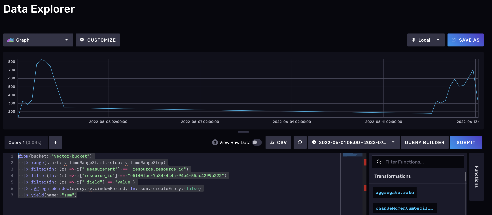

# vector-test

Playground around vector and webserver logs.

## Things as they stand

### Stack

`vector` and `influxdb2` with a docker-compose to run it quickly.

The influxdb bucket, org, token... is created automatically at first run. The docker-compose should honor dependencies between services through healthchecks.

When launching the stack, it also launches the pipeline computation (ie `vector` runs). It can take a while when processing big files, use `vector tap` (cf below) to see what happens!

### Pipeline

TLDR; count resources downloads, aggregate them over 1 minute and send them to influxdb. Lives in [vector.toml](vector.toml).

1. Open haproxy logs file(s) designated by `sources.haproxy.include`
2. Parses them as syslog, then via a custom regex as haproxy log components (HTTPLog)
3. Filter based on haproxy backend (data.gouv.fr) and status code (no errors)
4. Enrich with business info in `detect_type`: this is where you detect if it's a dataset, a resource... an api call or not...
5. Route based on `detect_type`: this dispatches the lines based on their type and allows custom logic for each type
6. `map_to_resource` is specific to, well, resources. It uses a predefined [enrichment table](https://vector.dev/docs/reference/glossary/#enrichment-tables) which is use the resources catalog (you should download those in the `./tables/` directory, as `datasets.csv`, `organizations.csv`, `resources.csv`, `reuses.csv` from [the catalog provided on data.gouv.fr](https://www.data.gouv.fr/fr/datasets/catalogue-des-donnees-de-data-gouv-fr/)). This is where you can find a resource and dataset id based on the request
7. `metric_count_resources` transforms the log line to a metric — basically it keeps only the fields we need and define a pivot field for metrics computation (what to count)
8. `aggregate_resources`: aggregate (sum) over 1 minutes
9. Push the results to influxdb

### Sink and exploitation

This is the current data model sent from vector to influxdb.

```json
{
   "name":"resource_id",
   "namespace":"resource",
   "tags": {
      "dataset_id":"5f733777722fc12a413290eb",
      "method":"GET",
      "request_api":"false",
      "resource_id":"01466800-c1cb-48f4-b7f6-bf1615c34e7f",
      "status_code":"200"
   },
   "timestamp":"2022-06-04T00:00:21Z",
   "kind":"incremental",
   "counter": {
      "value":2.0
   }
}
```

influxdb indexes `tags` as fields, in a measurement named by `namespace`.`name`, with the associated `timestamp` and `counter.value` as value.

influxdb exposes a dashboard on http://localhost:8086/ (influxdb/influxdb) where it's possible to query the timeseries. For example, this queries the download count over time for a given resource.

```
from(bucket: "vector-bucket")
  |> range(start: v.timeRangeStart, stop: v.timeRangeStop)
  |> filter(fn: (r) => r["_measurement"] == "resource.resource_id")
  |> filter(fn: (r) => r["resource_id"] == "e5f40fbc-7a84-4c4a-94e4-55ac4299b222")
  |> aggregateWindow(every: v.windowPeriod, fn: sum, createEmpty: false)
  |> yield(name: "sum")
```



## Other things tested

- `clickhouse` sink: big heavy stuff, couldn't manage to insert proper data into it (but the transform pipeline was not great at that point)
- [logs vs metrics](https://vector.dev/docs/about/under-the-hood/architecture/data-model/#event-types): logs would be one unfiltered line, metrics associate a value to a line or an aggregate of line. Seems more appropriate now that I've understood how it works, not easy at first
- metric type: [counter](https://vector.dev/docs/about/under-the-hood/architecture/data-model/metric/#counter) vs [set](https://vector.dev/docs/about/under-the-hood/architecture/data-model/metric/#set) — with aggregation, counter works pretty well
- [`vector tap` in docker-compose](https://vector.dev/guides/level-up/vector-tap-guide/): pretty neat to log stuff when streaming, but does not work for a test with a small file (file is processed before vector opens its tap)

## TODO

- handle resource duplication when going through a permalink then static.data.gouv.fr: could be done by querying the resources table and ignoring the hit when it belongs to a resource with a static.data.gouv.fr. VRL seems able to handle that
- handle datasets, reuses, organizations... hits

## Questions and remarks

- Is influx the right sink? FluxQL needs some getting used to... Needs to be battle tested. Time-series pattern looks promising for our use case though.
- Aggregation: should we aggregate and on what window?
- This stack might seem overkill for a single metric computation. Still, I believe it's very flexible for future use cases (ops logs, other business computations...). Vector can be deployed as [a distributed agent](https://vector.dev/docs/setup/deployment/topologies/#distributed) on multiple servers communicating with a central aggregator easily (it's just a source and sink!). We could deploy it everywhere we need to monitor or query something, whatever it is. We can even [plug it natively into our kafka stream](https://vector.dev/docs/setup/deployment/topologies/#stream-based). Also, the pattern is coherent with what we're building with Kafka and data analysis services, it's kind of an event based logging thingy, with consumers and stuff.
- FYI, vector is written in Rust and influxdb in Golang
